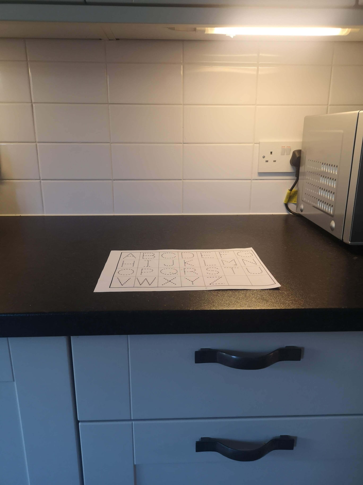

<!--
.. title: Scanning Documents for Online Tutorial and Exam Submission
.. slug: scanning-recommendations
.. date: 2020-04-05 22:21:20 UTC+01:00
.. tags: 
.. category: 
.. link: 
.. description: 
.. type: text
-->

_You can also download a_ _[pdf version of this recommendation](/files/teaching/scanning-recommendations.pdf)_.

**Trinity Term 2020 test takers**, please see the [dedicated section below](#trinty-term-test-takers).

This document describes how you can use your phone or tablet to produce clear scans of
your work as PDF files that are modest in size. The final section is written for Trinity
Term 2020 open-book test-takers since these students may be scanning documents under a
tight time constraint. If you have any comments of know of software that works better,
please let me know at
[kevin.sheppard@economics.ox.ac.uk](mailto:kevin.sheppard@economics.ox.ac.uk).

# Flatbed Scanners

If you have access to a flatbed scanner, this will produce the highest quality scan. I
recommend you use 300dpi in black and white mode when scanning documents for submission.
This balances file size against the image's resolution. Grayscale and color generally
produce files that are larger and that are not usually easier for assessors or tutors to
read. 

# General Instructions

## Lighting

Poor lighting is the simplest method to produce a scan that is hard or impossible to
read. Side lighting is key to creating a high-quality scan when using a phone or tablet.
Overhead lighting is your enemy since it is likely that your body or your device will
cast an unnecessary shadow. Look around your environment for locations that have a
reliable source of side lighting. When scanning in the day, indirect outside light can
produce an excellent source for producing high-quality scans. Direct sunlight can lead
to overexposure and is not recommended. Alternatively, you might find locations with
under cabinet lighting. I have good experience using these. Finally, a desk lamp can be
positioned to produce side lighting where both you and your device will not case a
shadow. If you do not have a good location with side lighting, you can use your device's
flash. In my experience, this produces slightly worse quality scans than having a good
lighting setup, but it is much better than having a shadow on your document. The image below
shows a scan created with uniform lighting that originated from the side.

Th next scan was created with a strong shadow that was produced by my arm. This tricked the
software into thinking that this was a color document.

This final scan was produced by Genius Scan. The device cast a strong shadow on the page
which resulted in a large dark area.

## Background

Assuming you are writing on white paper, you want to scan on a background that has high
contrast. Black, dark brown, and most other dark colors produce high contrast, which
lets the software function better. The next image shows my preferred
scanning location in my home. 

It is a dark kitchen worktop which provides great
contrast. It is illuminated by under cabinet lighting, and so I cannot cast shadows with
my body or my device. Note that when scanning, I turn off the other lights in the
kitchen so that the under-counter lights are the strongest source of illumination.

## Device Position

It is important that you hold your device level and that the document occupies the
majority of the viewfinder when scanning. Most high-quality scanning software will
encourage optimal camera positioning.

## Multi-page Documents

Most documents you scan will consist of multiple pages. You should scan these
consecutively by adding a new page to your current scan. If you make a mistake, I
recommend reshooting the problematic page and then continuing to the end of the
document. All of the recommended software lets you delete a page after you finish
scanning.

# Software Recommendations

## iOS (iPad/iPhone)

There are two apps I recommend: [Genius
Scan](https://apps.apple.com/gb/app/genius-scan-pdf-scanner/id377672876) (4.8 rating,
35,000 reviews) and [Scanner
Pro](https://apps.apple.com/us/app/scanner-pro-pdf-scanner-app/id333710667) (4.9 rating
130,000 reviews). Genius Scan is free and has a paid upgrade. It works well enough in
the free mode to use for exam and assignment submission. Scanner Pro has a modest price.
Both of these apps have great auto edge detection when used on a high contrast
background. ScannerPro is more forgiving to uneven lighting and tends to produce softer
shadows if present. ScannerPro is my recommendation if the price is not an issue.

## Android

[Genius
Scan](https://play.google.com/store/apps/details?id=com.thegrizzlylabs.geniusscan.free&hl=en_GB)
(4.7 rating, 78,000 reviews) is also available for Android and is, in my experience, the
most accurate scanner.
[CamScanner](https://play.google.com/store/apps/details?id=com.intsig.camscanner&hl=en_GB)
(4.8 rating, 2.5M reviews) also works well, although it is not as accurate at automatic
edge detection. It does have some party trick modes that work well if you have a text
that is mostly monochrome text but contains a full-color diagram. Genius Scan is my
recommendation if you have a good lighting setup. If not, I would use CamScanner.

There are many other scanners, so please do try others if you are not happy with
these. 

## Genius Scan Settings

* Set Image Quality to medium before scanning your document (Menu > Settings > Image Quality > Medium).
  I Could not detect any relevant differences when scanning black and white documents
  across Medium, High, and Highest.  File sizes, however, do vary with this setting, and Medium
  minimizes the output size of the PDF without compromising legibility.

* Edit images before exporting. After you have scanned the document, you can tap on any page to
  open the edit view.  Editing lets you:
  
  - Adjust the scanning mode to select Black & White if color incorrectly was detected;
  - Rotate the images so that they have the correct orientation; and
  - Recrop any images where GeniusScan's edge detection was not adequate.

* Change the _File size_ when exporting.  GeniusScan will **estimate** the size of the file after
  export. In my tests, Small produced files that are easy to read (about 600kB per scanned page,
  when used with Medium image quality). The table below shows the **estimated** size of the file
  exported using combinations of Image Quality and _File size_.  Medium/Medium and Medium/Large
  appear to be the most sensible choices. Both Highest Image Quality and Actual _File size_ should
  be avoided. 
 
  | Image Quality | Small | Medium  | Large  | Actual  |
  | ---           | ----: | ------: | -----: | ------: |
  | Low           | 571kB | 640kB   | 811kB  | 2.1MB   |
  | Medium        | 1.2MB | 1.3MB   | 1.7MB  | 4.3MB   |
  | High          | 2.1MB | 2.3MB   | 2.9MB  | 7.5MB   |
  | Highest       | 3.6MB | 4.0MB   | 5.1MB  | 13MB    |

   I have included two sample files where you can compare
   [Highest/Actual](/files/teaching/scanning/highest-actual.pdf) with
   [Medium/Small](/files/teaching/scanning/medium-small.pdf). Note that the
   file size of the Medium/Small file is 2.5MB, not 1.2MB, as estimated by GeniusScan. 

### Excessively Large Scans

If you attempt to export and the resulting file is excessively large, you can split a scan
in GeniusScan. 

1. Begin by selecting the document.
2. Long press a page in the second half of the document.
3. Select all pages in the second half.
4. Select the move icon and select _New document_.

The animation below illustrates these steps.

You will then need to rejoin the parts into a single PDF using [PDF Sam Basic](#pdf-sam)
or an online tool.

### Excessively Large PDFs

If the PDF you have produced exceeds the upload limit, you can compress it using
an [online PDF compressor](https://www.ilovepdf.com/compress_pdf).  I recommend using the
most conservative compression (_Less Compression_) which reduced scanned file sizes by 50% in 
my experiments. 

# Additional Issues

_I do not believe that at-home exam takers need to be overly concerned with carefully_
_formatting their exam answers. If pressed for time, it is reasonable to refer a_
_hand-drawn diagram or equation on another page. If you have time, your assessors will_
_appreciate your efforts to produce an easier to read answer. If under time pressure and_
_you have two files, combining them into a Zip file before uploading._
  

## Embedding Images in Documents

When writing essays, you may need one or more diagrams or one or more equations. The best
format (as in nicest for your tutor or assessor) is to embed the image into your word document.
The simplest method to do this is to:

* draw your diagram;
* photograph it;
* crop it tightly on your device; and
* email it to yourself, upload to a file service (Dropbox, Google Drive, or OneDrive), or let a
  service like Google Photos or iCloud to automatically back up the photo. You can encourage
  Google photos to back up your images by opening the Google photos app.  The image will then
  be available [through your browser](https://photos.google.com/).

You should then be able to directly insert the equation or diagram into your document
without further formatting.

## Snipping Tools

Snipping is a simple way to copy anything you can see on your computer into a Word
or Google docs document.  You can snip just the content you want, and so should not 
need to crop the image further.

* Windows 10: The preferred option is _Snip and Sketch_. The snipping window can be opened using
  `Win`+`Shift`+`S`.
* Windows 7/8: These operating systems come with a program called _Snipping Tool_.
* macOS: `Command` + `Shift` + `4` allows you to select a region to copy.
  
## Combining PDFs

You may have assignments or exams that require mixed answers where some questions
are standard essays, while others require more calculation. If your answer is
spread between a Word document or a Google doc and a scanned PDF, you should combine
these into a single PDF before submission.

There are two simple methods. The first uses a web service appropriately titled
[Combine PDF](https://combinepdf.com/). You can upload two or more PDFs, use
drag-and-drop to arrange their order, combine them, and then download them. This
methods comes with a standard disclaimer about privacy. Combine PDF states they delete
all content after an hour, but they do not have a Privacy Policy visible.

The second uses [PDF Sam Basic](https://pdfsam.org/) to merge them. PDF Sam is both
free to use and open source.  This program has to be locally installed to use. Merging
two or more PDFs can be done by:

* select merge;
* use Add to add each of your files;
* select the output pdf file; and
* click on Run. 

# Trinity Term 2020 Test Takers

## Moving your PDF

You will most likely want to move your scan onto your laptop before uploading it to the
submission server. You must have a good, reliable, and quick method for moving your file
out of your scanning software. I almost always upload to Dropbox (Google Drive and
OneDrive are also good choices) and use email as a backup if Dropbox fails. You can also
save the file locally and then use a free service like
[Firefox Send](https://send.firefox.com/)
([https://send.firefox.com/](https://send.firefox.com/)) to move the file if needed.

## Practice, Practice, and Practice Again

If you are preparing for exams, you must practice with whatever method you are going to
use. You need to practice scanning documents that have sizes that you expect to have for
your exam, i.e., 10 – 15 pages, depending on your handwriting. You should practice until
scanning and getting the document off of your device until it is second nature. The last
thing you want is to be stressed in the final minutes of an open -book exam. You
should: 

* know which app you are going to use; 
* know where you will be scanning your paper; 
* know how you will get your PDF off of your device; 
* have a backup method to get it off your device (e.g., a USB cable to your laptop or
using a temporary upload service like [Firefox Send](https://send.firefox.com/))

You should practice the entire process during the University dry-runs. Be sure to check
the size of the file produced using your preferred method. Larger files are more likely
may cause difficulties uploading, all things equal.

## ALWAYS UPLOAD SOMETHING

If you are pressed for time and are having any difficulties, you must upload any copy,
no matter how poor, of your exams before the deadline. Your uploaded copy will be
inspected, and if it is illegible, then you will be asked to upload a better version
later. The improved copy will be compared to the original submission to verify that it
contains the same material.

